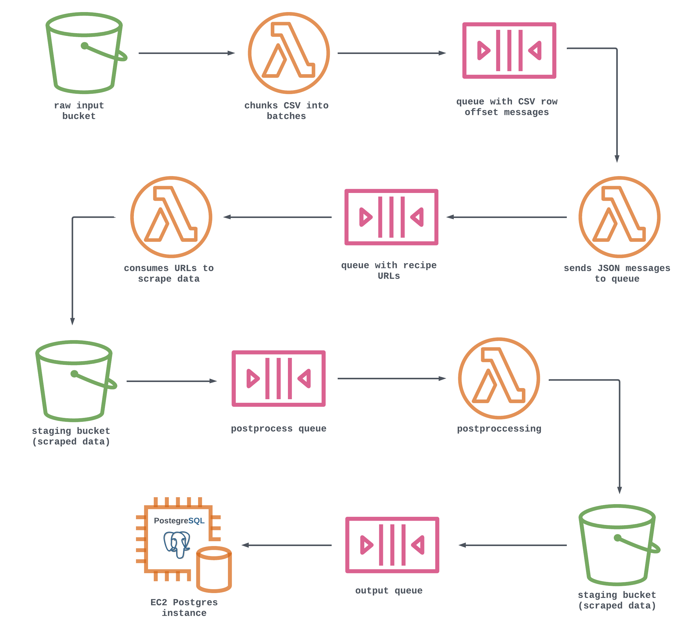

# **RecipesPlease FastAPI REST API**

______________________________________________________________________________

## **Table of contents**
1. [Introduction](#introduction)
2. [How It Works](#how-it-works)
3. [ETL Ingestion Pipeline](#etl-ingestion-pipeline)
6. [Usage](#usage)
7. [Contributions](#contributions)
8. [License](#license)
 

## **1. Introduction** 

Welcome to the `RecipesPlease` FastAPI REST API documentation.  
You've stumbled upon the backend engine of the soon-to-be `RecipesPlease` web application (currently undergoing a rigorous construction phase).
 
 

## **2. How It Works** 

`RecipesPlease` is a dynamic web application designed to simplify the cooking experience for users by suggesting recipes based on the ingredients they have on hand. This API empowers the application's core functionality by processing user queries and delivering tailored recipe recommendations.
 
 

## **3. ETL Ingestion Pipeline** 

## **4. Usage** 

Let's get into some detailed information about each endpoint in the works, including their descriptions, expected input parameters, and the type of data they return.

1. `directions_by_dish_id`
* Description: Retrieves directions for a dish given a specific dish_id.
* Input: `dish_id` (int or list): Unique identifier(s) of the dish(es) to search for.
* Return: A list of dictionary key-value pairs [{"dish_id": "dish id string", "directions" : ["direction1", "direction2"]}].

2. `dishes_by_dish_id`
* Description: Retrieves a dish name given a specific dish_id.
* Input: `dish_id` (int or list): Unique identifier(s) of the dish(es) to search for.
* Return: A list of dictionary key-value pairs [{"dish_id": "dish id string", "dish" : "dish name string"}]

3. `dishes_by_ingredients`
* Description: Retrieves a list of dishes that include a given set of ingredients.
* Input: `ingredients` (str or list): Ingredient(s) to search for.
* Return: A list of dictionary key-value pairs [{"dish": "dish name string", "ingredients" : ["ingred1", "ingred2"]}]

4. `suggested_ingredients`
* Description: Retrieves recommendations for ingredients based on partial input, returning a list of suggested ingredients that closely match the provided criteria.
* Input: `search` (str): Partial ingredient name to search for.
* Return: A dictionary mapping `'suggestions'` to a list of suggested ingredients {'suggestions': [ingredients]}
 

## **5. Contributions** 
The recipe data used in this project was obtained using URLs from [RecipeNLG GitHub Repository](https://github.com/Glorf/recipenlg/tree/main), authored by [Glorf](https://github.com/Glorf). We want to express our gratitude to [Glorf](https://github.com/Glorf) for making this dataset available to the community. The dataset is associated with their work as detailed in the paper: "[RecipeNLG: A Cooking Recipes Dataset for Semi-Structured Text Generation](https://aclanthology.org/2020.inlg-1.4.pdf)" by Michał Bień, Michał Gilski, Martyna Maciejewska, Wojciech Taisner, Dawid Wisniewski, Agnieszka Lawrynowicz. 

Without you, our recipes might have been limited to PB&Js.
 
 

## **6. Licence** 
This project is licensed under the MIT License - see the [LICENSE](LICENSE) file for details.
 
 
