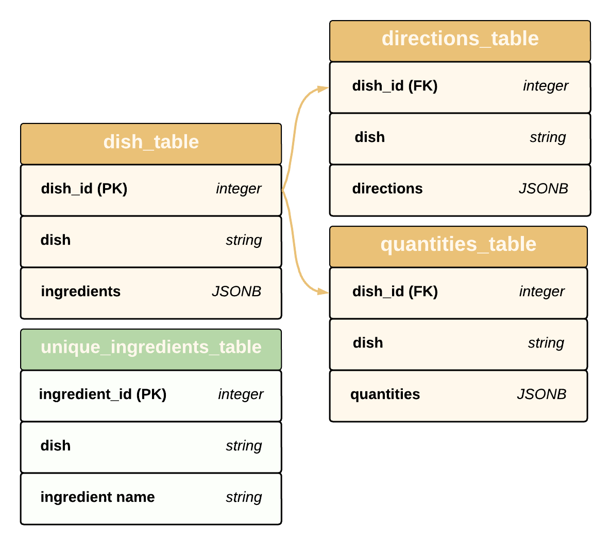

<center>

# **PantryMatch FastAPI REST API**
Discover recipes using ingredients on hand.

</center>

______________________________________________________________________________

## **Table of contents**
1. [Introduction](#introduction)
2. [How It Works](#how-it-works)
3. [Data](#data)
    1. [Data Structure](#subparagraph1)
    2. [Columns](#subparagraph2)
    3. [Database Schema](#subparagraph3)
6. [Usage](#usage)
7. [Contributions](#contributions)
8. [License](#license)
<br/>

## **Introduction** <a name="introduction"></a>

Welcome to the `PantryMatch` FastAPI REST API documentation. <br/>
You've stumbled upon the backend engine of the soon-to-be `PantryMatch` web application (currently undergoing a rigorous construction phase). Now, hold onto your chef's hat because, much like the `PantryMatch` web app, this API is still under construction. But fear not! We're working tirelessly to make this resource a reality. 
<br/>
<br/>

## **How It Works** <a name="how-it-works"></a>

`PantryMatch` is a dynamic web application designed to simplify the cooking experience for users by suggesting recipes based on the ingredients they have on hand. This API empowers the application's core functionality by efficiently processing user queries and delivering tailored recipe recommendations.
<br/>
<br/>

## **Data** <a name="data"></a>

> ## **Data Structure** <a name="subparagraph1"></a>
> 
> Integrating millions of recipes, we subjected our data to thorough cleaning and formatting. Here are some technical specs:
> 
> **Shape**: 2,231,142 rows and 5 columns <br/>
> 
> **Columns:** <a name="subparagraph2"></a>
> Let's elaborate on our 5 columns... <br/>
> 
> **`uid`**: Unique identifier for each recipe, integer (0 - n rows) <br/>
> ```
> 0
> 1
> ...              
> 2231140
> 2231141 
> ```
> **`dish`**: Name of the dish, string <br/>
> ```>>> recipes.dish.head(3)
> 0      No-Bake Nut Cookies
> 1    Jewell Ball's Chicken
> 2              Creamy Corn
> ```
> 
> **`ingredients`**: List of ingredients used in the recipe, list <br/>
> ```>>> recipes.ingredients.head(3)
> 0    ['brown sugar', 'milk', 'vanilla', 'nuts', 'butter', 'bite size shredded rice bi...]
> 1    ['beef', 'chicken breasts', 'cream of mushroom soup', 'sour cream']
> 2    ['frozen corn', 'cream cheese', 'butter', 'garlic powder', 'salt', 'pepper']
> ```
> 
> **`quantities`**: Quantities of each ingredient used, list <br/>
> ```>>> recipes.quantities.head()
> 0    ['1 c. firmly packed brown sugar', '1/2 c. evaporated milk', '1/2 tsp. vanilla', ...]
> 1    ['1 small jar chipped beef, cut up', '4 boned chicken breasts', '1 can cream of m...]
> 2    ['2 (16 oz.) pkg. frozen corn', '1 (8 oz.) pkg. cream cheese, cubed', '1/3 c. but...]
> ```
> 
> **`directions`**: Cooking instructions for the recipe, list <br/>
> ```>>> recipes.directions.head(3)
> 0    ['In a heavy 2-quart saucepan, mix brown sugar, nuts, evaporated milk and butter ...]
> 1    ['Place chipped beef on bottom of baking dish.', 'Place chicken on top of beef an...]
> 2    ['In a slow cooker, combine all ingredients.', 'Cover and cook on low for 4 hours...]
> ```
> 
> 
> ## **Database Schema** <a name="subparagraph3"></a>
> 
> Following the data preparation, the information was migrated into an AWS EC2-hosted Postgres database. Within this environment, it was strategically divided into tables to facilitate efficient and targeted query operations.
>  <br/>
> 
> The `dish_id` in `dish_table` serves as the primary key, while in `directions_table` and `quantities_table`, it functions as a foreign key—establishing a relationship between the tables. Additionally, the `unique_ingredients_table` operates independently and is unrelated to the other two, primarily serving for autocomplete functionality.
> 
> 
> 

## **Usage** <a name="usage"></a>

Next, let's get into some detailed information about each endpoint in the works, including their descriptions, expected input parameters, and the type of data they return.

1. `directions_by_dish_id`
* Description: Retrieves directions for a dish given a specific dish_id.
* Input: `dish_id` (int or list): Unique identifier(s) of the dish(es) to search for.
* Return: A dictionary mapping dish_id to their respective cooking directions {dish_id: [directions]}.

2. `dishes_by_dish_id`
* Description: Retrieves a dish name given a specific dish_id.
* Input: `dish_id` (int or list): Unique identifier(s) of the dish(es) to search for.
* Return: A dictionary mapping dish_id to their respective dish names {dish_id: dish}.

3. `dishes_by_ingredients`
* Description: Retrieves a list of dishes that include a given set of ingredients.
* Input: `ingredients` (str or list): Ingredient(s) to search for.
* Return: A dictionary mapping dishes to their respective list of ingredients {dish: [ingredients]}.

4. `ingredients_by_dishes`
* Description: Retrieves a list of ingredients given a specific dish name.
* Input: `dishes` (str or list): Dish name(s) to search for.
* Return: A dictionary mapping dishes to their respective list of ingredients {dish: [ingredients]}.

5. `suggested_ingredients`
* Description: Retrieves recommendations for ingredients based on partial input, returning a list of suggested ingredients that closely match the provided criteria.
* Input: `search` (str): Partial ingredient name to search for.
* Return: A dictionary mapping `'suggestions'` to a list of suggested ingredients {'suggestions': [ingredients]}
<br/>

## **Contributions** <a name="contributions"></a>
The recipe data used in this project was obtained from the [RecipeNLG GitHub Repository](https://github.com/Glorf/recipenlg/tree/main), authored by [Glorf](https://github.com/Glorf). We want to express our gratitude to [Glorf](https://github.com/Glorf) for making this dataset available to the community. Without you, our recipes might have been limited to PB&Js. 
<br/>
<br/>

## **Licence** <a name="licence"></a>
This project is licensed under the MIT License - see the [LICENSE](LICENSE) file for details.
<br/>
<br/>

